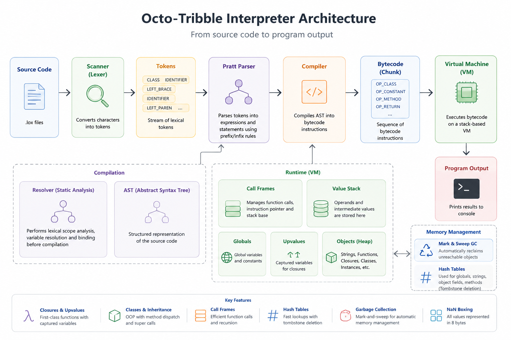

# Octo-Tribble Interpreter

A complete implementation of the **Lox programming language** featuring both a **Tree-Walk Interpreter** and a **Bytecode Virtual Machine**.

This project explores how modern language runtimes work under the hood, from lexical analysis and parsing to bytecode execution, garbage collection, and runtime optimizations.

---

## Repository Structure

```text
treewalk/  -> Tree-walk interpreter (jlox)
vm/        -> Bytecode compiler and virtual machine (clox)
tool/      -> AST generation utilities
```

## Architecture



---


## Highlights

* Pratt Parser for expression parsing
* Stack-Based Bytecode Virtual Machine
* Closures and Upvalue Capture
* Static Scope Resolution
* Call Frame Based Function Execution
* Hash Tables with Tombstone Deletion
* String Interning
* Mark-and-Sweep Garbage Collection
* Class-Based Object System
* Inheritance and `super`
* NaN-Boxed Value Representation

---

## Architecture

The VM follows a traditional language implementation pipeline:

**Source Code → Scanner → Pratt Parser → Compiler → Bytecode → Virtual Machine → Output**

### Scanner

Converts raw source code into a stream of tokens.

### Pratt Parser

Parses expressions using prefix and infix parse rules while handling operator precedence and associativity.

### Compiler

Translates parsed expressions directly into bytecode instructions.

### Virtual Machine

Executes bytecode using a stack-based architecture and supports functions, closures, classes, inheritance, and native functions.

---

## Runtime Features

### Closures & Upvalues

Closures capture variables from surrounding scopes. Upvalues allow captured variables to outlive the stack frame that created them.

### Static Scope Resolution

A dedicated resolver performs lexical scope analysis before execution, enabling efficient variable lookup and correct closure binding.

### Call Frames

Function calls are implemented using call frames, allowing recursion and nested function execution.

### Hash Tables & Tombstones

Custom hash tables are used for globals, methods, object fields, and string interning. Deleted entries are replaced with tombstones to preserve probe chains and maintain lookup performance.

### Mark-and-Sweep Garbage Collection

Memory is automatically managed using a tracing garbage collector that marks reachable objects and reclaims unused memory.

### NaN Boxing

Runtime values are stored using NaN Boxing, allowing numbers, booleans, nil, and object references to fit into a single 64-bit value.

---

## Example

```lox
class Animal {
    speak() {
        print "animal";
    }
}

class Dog < Animal {
    speak() {
        super.speak();
        print "woof";
    }
}

Dog().speak();
```

Output:

```text
animal
woof
```

---

## Building

### Bytecode Virtual Machine (clox)

```bash
cd vm
gcc *.c -o clox
```

### Tree-Walk Interpreter (jlox)

```bash
cd treewalk
javac *.java
```

## Running

### VM

```bash
cd vm
./clox.exe ../test.lox
```

### Java Interpreter

```bash
cd treewalk
java Lox ../test.lox
```

---

## Major Components

| Component         | Purpose                      |
| ----------------- | ---------------------------- |
| Scanner           | Lexical Analysis             |
| Pratt Parser      | Expression Parsing           |
| Compiler          | Bytecode Generation          |
| VM                | Bytecode Execution           |
| Resolver          | Static Scope Analysis        |
| Hash Table        | Symbol Storage               |
| Garbage Collector | Memory Management            |
| Object System     | Classes & Inheritance        |
| NaN Boxing        | Compact Value Representation |

---

## References

Inspired by the ideas presented in *Crafting Interpreters* by Robert Nystrom, with additional refactoring, optimizations, and runtime enhancements throughout the implementation.
